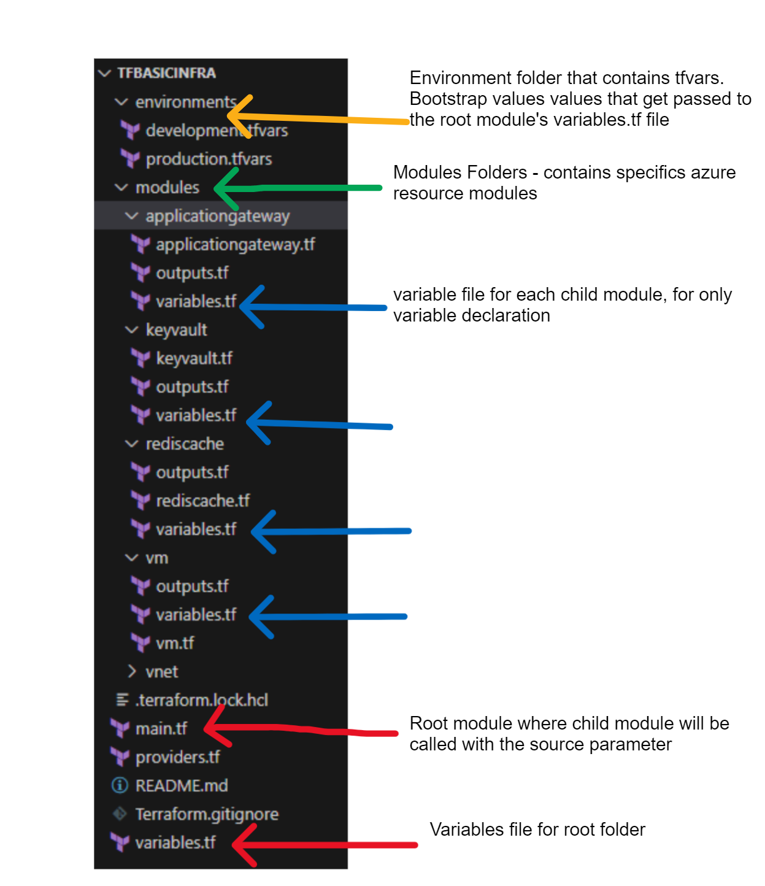

<h3 align="center">Basic Terraform Azure Deploymement</h3>


------------------------------

<p align="reight"> This repo contains Azure Terraform modules to deploy the following resources
    <br> 
</p>

- A virtual Network with multiple subnets
- Multiple SQL Server VM
- Multiple Azure Virtual VMs

- Application Gateway

- Azure Redish Cache 

- Azure KeyVault


The below image depicts the module folder structure



- The modules folder includes child modules that are seperated into different Azure resource type

- The .tf files in each child modules contains the required resources to create an Azure resource. For instance the vnet.tf contains the required resources to create the virtual network and subnets. The variables.tf file contains the relevant variables declaration (Variables.tf is for the declaration of variables, name, type, description, default values and additional meta data.) the modules requires. The outputs.tf file contains outputs that can be returned to the Terraform configuration

- The root/main.tf is known as the root module. Within it, the child modules referenced above can be declared

- The root variables.tf file includes all variables in the child modules for the whole environment.

- The providers.tf stores the terraform providers and backend information

- The environments/*.tfvars enables the passing variables from the child modules to the main/root module. Simply put tfvars is for giving the actual variable values during execution. It allows you to customize the specific execution. 

- More information on Terraform modules here [Modules](https://developer.hashicorp.com/terraform/tutorials/modules/module#what-is-a-terraform-module)

## 🏁 Getting Started <a name = "getting_started"></a>

### Prerequisites

1. Ensure that you have setup your Azure Cloud Shell environment.
2. (Optional) If you prefer to run the code on a local bash terminal, ensure that you have installed and configured Azure CLI and Terraform; and ignore step 3.
3. Log in to Azure Cloud Shell and select Bash terminal.
4. Set your Azure subscription
```
az account set --subscription <Name or ID of subscription>
```

### Deploy

1. Clone the Git Repository for the Labs

```
git clone https://github.com/IaCLearn/TFBasicInfra.git
```
2. Navigate to the directory
```
cd TFBasicInfra/
```
3. Edit the providers.tf file. To create the state file storage account in Azure, review this [Link](https://learn.microsoft.com/en-us/azure/developer/terraform/store-state-in-azure-storage?tabs=azure-cli)
     ```
     backend "azurerm" {
     resource_group_name  = ""
     storage_account_name = ""
     container_name       = ""
     key                  = "" }
    ```
    ```
    provider "azurerm" {
    features {}
    subscription_id   = ""
    tenant_id         = ""
    client_id         = ""
    client_secret     = ""
    }
    ```

3. Run the following terraform commands

```
terraform init
terraform terraform plan -var-file="environments/development.tfvars"
terraform apply -auto-approve -input=false -var-file="environments/development.tfvars"
```


## Cleanup

1. Navigate to the directory

```
cd TDBasicInfra
```

2. Run the following Terraform command:

```
terraform destroy -auto-approve -input=false -var-file="environments/development.tfvars"
```

## References

- Terraform Azure Provider Docs [Link](https://registry.terraform.io/providers/hashicorp/azurerm/latest/docs)

- Terraform on Azure Documentation. Microsoft [Link](https://learn.microsoft.com/en-us/azure/developer/terraform/)
